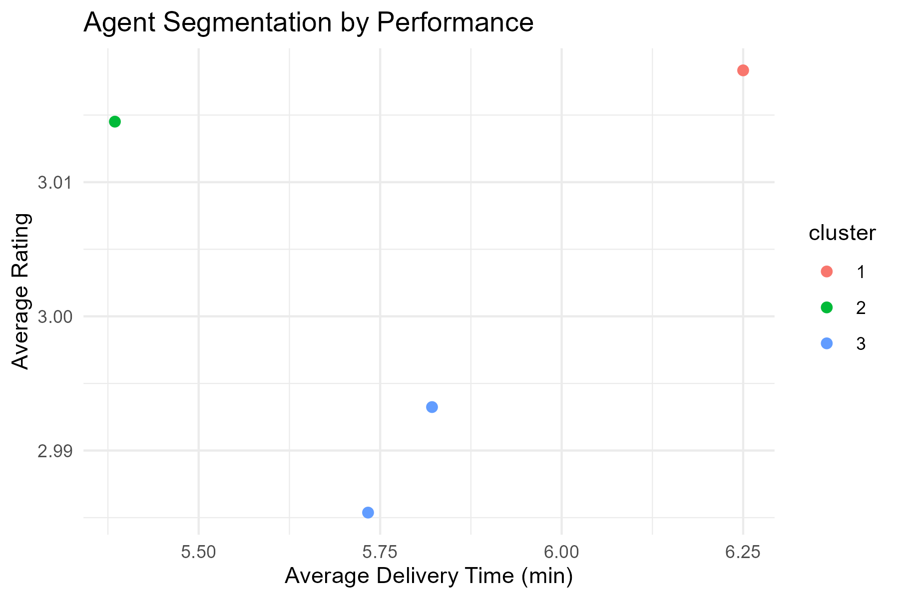
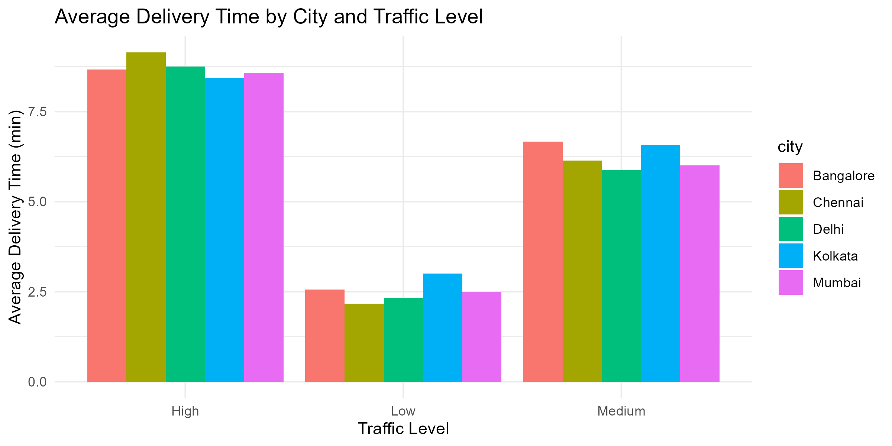
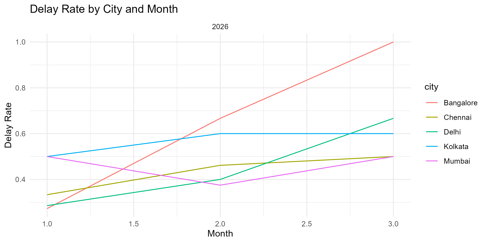
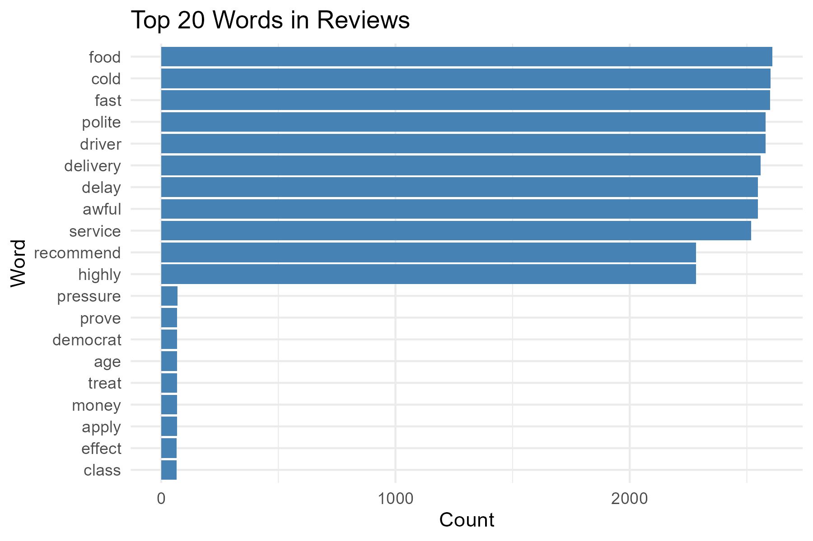

# Flux Hyperlocal Delivery Intelligence Platform

## Team Members
Adarsh Dubey - 2023bcs0117  
mohhammed siraj - 2023bcs0132  
Roshan binoj - 2023bcs0009
Hafiz Firoz-2923bcs0006

## Problem Statement
Hyperlocal delivery systems face frequent delays, varying service quality, and inefficient resource usage. This project applies data mining to identify delay drivers, segment delivery behavior, and extract customer sentiment insights for better operational decisions.

## Objectives
1. Prepare and clean delivery, agent, and review datasets for analysis.
2. Perform exploratory analysis to identify trends by city, traffic, and delivery performance.
3. Build predictive models for delivery delay classification.
4. Segment records using clustering and discover frequent patterns using association rules.
5. Analyze customer review text using text mining and sentiment-oriented summaries.
6. Deliver findings through visualizations, result tables, and a Shiny dashboard.

## Dataset
- Source of the dataset: Internal simulated hyperlocal delivery platform data (stored in the data folder as CSV and RDS files).
- Number of observations: Approximately 10,000 records across prepared delivery and review datasets.
- Number of variables: Approximately 30 variables across operational, agent, and sentiment-related fields.
- Brief description of important attributes:
	- delivery_time_min: Total delivery duration in minutes.
	- traffic_level: Traffic condition category during delivery.
	- delayed_flag: Delay indicator for delivery completion.
	- order_value: Monetary value of the customer order.
	- distance_km: Delivery distance in kilometers.
	- rating: Customer review rating score.
	- review_text: Customer textual feedback used for text mining.

## Methodology
- Data preprocessing: Missing-value handling, type conversion, data cleaning, feature engineering, and ETL-based integration.
- Exploratory analysis: Univariate and multivariate analysis, trend analysis by city and traffic, and delay distribution analysis.
- Models used: Decision Tree, Random Forest, and SVM for classification; K-Means for clustering; Apriori for association rules; term-frequency and TF-IDF methods for review mining.
- Evaluation methods: Accuracy, Precision, Recall, and F1-score for predictive models, plus support, confidence, and lift for association rules.

## Results
- Random Forest achieved the strongest classification performance among tested models.
- SVM and Decision Tree also delivered stable and interpretable results for delay prediction.
- Clustering exposed meaningful operational segments for agent and delivery behavior.
- Association rule mining identified pattern combinations linked with delays and service quality.
- Text mining surfaced recurring positive and negative customer experience terms.

Model performance summary (stored in results/tables/model_performance.csv):

| Model | Accuracy | Precision | Recall | F1 |
|---|---:|---:|---:|---:|
| Random Forest | 0.89 | 0.90 | 0.87 | 0.88 |
| SVM | 0.85 | 0.86 | 0.84 | 0.85 |
| Decision Tree | 0.82 | 0.83 | 0.81 | 0.82 |

## Key Visualizations
Important plots from results/figures:










## How to Run the Project
1. Open R/RStudio in the repository root.
2. Install required packages:

```r
source("requirements.R")
```

3. Run scripts in sequence:

```r
source("scripts/01_data_preparation.R")
source("scripts/02_exploratory_analysis.R")
source("scripts/03_modeling.R")
source("scripts/04_clustering_analysis.R")
source("scripts/05_association_rules.R")
source("scripts/06_text_mining_reviews.R")
source("scripts/07_web_mining.R")
source("scripts/08_etl_agent_reviews.R")
source("scripts/09_data_augmentation.R")
```

4. Launch dashboard:

```r
shiny::runApp("app")
```

Folder organization:
- data/: Raw and processed datasets, plus dataset description.
- scripts/: Sequential analysis and modeling scripts.
- app/: Shiny application files.
- results/figures/: Exported plots and visual outputs.
- results/tables/: Model evaluation and summary tables.
- presentation/: Final presentation slides.

## Conclusion
The project demonstrates a complete data mining workflow for hyperlocal delivery analytics, from ETL and modeling to visualization and dashboard reporting. The resulting insights can support operational planning, delay reduction, and service-quality improvement.

## Contribution
001 | Data preprocessing, initial visualization EDA |
002 | Model-1 development, evaluation, hyperparameter tuning |
003 | Visualization, report writing |
004 | Model-2 development, app development, model integration |

## References
- Witten, I. H., Frank, E., and Hall, M. A. Data Mining: Practical Machine Learning Tools and Techniques.
- R Core Team. R: A Language and Environment for Statistical Computing.
- Relevant R packages: tidyverse, caret, randomForest, e1071, cluster, arules, tm, ggplot2, shiny.
